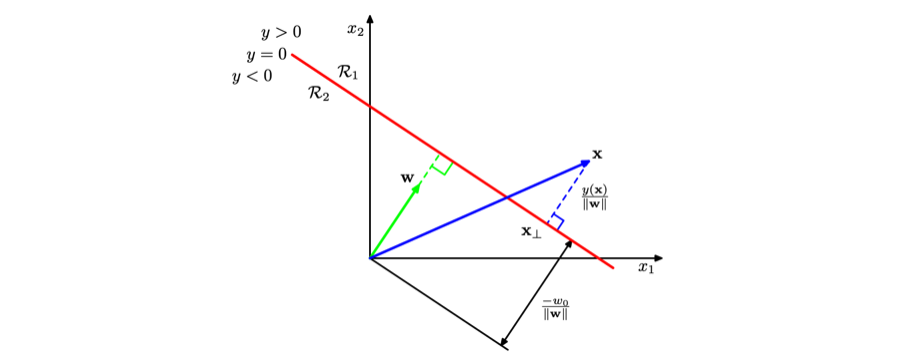
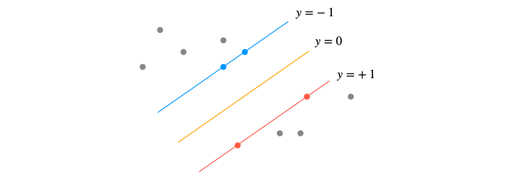

> Bishop, "Pattern Recognition and Machine Learning." 교재 내에서, 개인적으로 포스팅으로 정리하고 싶은 내용을 선정하여 기록하였습니다. 해당 교재는 [이곳](https://www.microsoft.com/en-us/research/people/cmbishop/#prml-book?from=http%3A%2F%2Fresearch.microsoft.com%2Fen-us%2Fum%2Fpeople%2Fcmbishop%2F)에서 확인할 수 있으며, 교재 외에 내용도 필요에 따라 추가하였습니다. 공부 진행 상황에 따라서 계속 내용을 추가 중에 있습니다.

### Information Theory

##### Relative Entropy

- **Kullback-Leibler Divergence**와 동일한 개념

$$
\begin{aligned}
\mathrm{KL}(p||q) 
&= -\int p(\mathbf x) \ln q(\mathbf x) \mathrm d \mathbf x  - \left(-\int p(\mathbf x) \ln p(\mathbf x) \mathrm d \mathbf x \right) \\
&=-\int p(\mathbf x) \ln \left\{ \frac{q(\mathbf x)}{p(\mathbf x)} \right\} \mathrm d \mathbf x
\end{aligned}
$$

- Cross Entropy - Shannon Entropy의 형태를 가짐

##### Jensen's Inequality

- **Convexity**: 모든 $a$와 $b$에 대해서, $f(\lambda a + (1-\lambda)b) \leqslant \lambda f(a) + (1-\lambda)f(b)$ 만족하는 함수 $f$는 convex
- 수학적 귀납법을 사용하면 convex function $f(x)$가 다음을 만족함을 증명 가능 (증명 과정은 생략). 이 식을 **Jensen's Inequality**라 함

$$
f\left(\sum^M_{i=1} \lambda_i x_i \right) \leqslant \sum^M_{i=1} \lambda_i f(x_i)
$$

- $\lambda_i$를 이산 변수 $x$에 대한 확률 분포라고 해석하면 위의 식을 다음과 같이 다시 적을 수 있음

$$
f(\mathbb E[x]) \leqslant \mathbb E[f(x)]
$$

- 연속 변수에 대한 Jensen's Inequality는 다음 형태를 취함

$$
f\left(\int \mathbf x p(\mathbf x)\mathrm d \mathbf x \right) \leqslant \int f(\mathbf x)p(\mathbf x)\mathrm d \mathbf x
$$

- Kullback-Leibler Divergence 식에 Jensen's Inequality를 적용하면, **KLD가 언제나 0 이상의 값을 가진다는 사실을 확인**할 수 있음
  - $f(x) = -\ln(\frac{q(\mathbf x)}{p(\mathbf x)})$로 두고, $\int q(\mathbf x)\mathrm d \mathbf x = 1$. 즉, $-\ln\int q(\mathbf x)\mathrm d \mathbf x = 0$이라는 사실을 사용

$$
\mathrm{KL}(p||q) = - \int p({\bf x})\ln\left\{\dfrac{q({\bf x})}{p({\bf x})}\right\}\mathrm d \mathbf x \geqslant - \ln \int q({\bf x})\mathrm d \mathbf x = 0
$$

##### Mutual Information

- Mutual information은 **두 변수 $\mathbf x, \mathbf y$가 서로 얼마나 독립적인지를 파악**하는데에 도움을 줌
- 즉, 두 변수가 완전히 독립일 경우엔 $p(\mathbf x, \mathbf y) = p(\mathbf x)p(\mathbf y)$일 것이므로, 이를 **$p(\mathbf x, \mathbf y)$와 $ p(\mathbf x)p(\mathbf y)$ 사이의 KLD를 계산**함으로써 확인
  - $\mathrm{KL}( p(\mathbf x, \mathbf y) || p(\mathbf x)p(\mathbf y))=0$인 경우에 두 변수 $\mathbf x, \mathbf y$는 서로 독립
  - **독립**: 한 사건이 일어날 확률이 다른 사건이 일어날 확률에 영향을 미치지 않는 것

$$
\mathbf I[{\bf x}, {\bf y}] \equiv \mathrm{KL}(p({\bf x}, {\bf y})||p({\bf x})p({\bf y})) = - \iint p({\bf x}, {\bf y})\ln\left(\dfrac{p({\bf x})p({\bf y})}{p({\bf x}, {\bf y})}\right)\mathrm d \mathbf x \mathrm d \mathbf y
$$

- 확률의 합과 곱의 법칙을 적용하면 다음과 같이 표현 가능
  - 의미 1: **${\bf y}$에 대해 알고있을 때, ${\bf x}$에 대한 불확실성을 표현** (혹은 그 반대)
  - 의미 2: 베이지안의 관점에서는, $p(\mathbf x)$를 $\mathbf x$에 대한 사전 분포, $p(\mathbf x | \mathbf y)$를 새로운 데이터 $\mathbf y$를 관찰한 후의 사후 분포로 볼 수 있음. 따라서 **mutual information은 새 관찰값 $\mathbf y$의 결과로 인해 줄어드는 $\mathbf x$에 대한 불확실성**을 표현 

$$
\mathbf I[{\bf x}, {\bf y}] = \mathbf H[{\bf x}] - \mathbf H[{\bf x}|{\bf y}] = \mathbf H[{\bf y}] - \mathbf H[{\bf y}|{\bf x}]
$$

### Convex Optimization

- 이 파트는 "모두를 위한 컨벡스 최적화" [저장소](https://github.com/convex-optimization-for-all/convex-optimization-for-all.github.io)의 자료와 [이곳](https://www.stat.cmu.edu/~ryantibs/convexopt-F16/)을 참고하여 작성하였습니다.

##### Dual Problem

- Linear Programming (LP): 목적함수(objective function)와 제약함수(constraint function)가 모두 선형 함수로 주어지는 최적화 문제
- Quadratic Programming (QP): 목적함수(objective function)가 convex quadratic이고, 제약함수(constraint functions)가 선형 함수로 주어지는 최적화 문제
- What is '*Duality*'?: 하나의 최적화 문제를 **primal problem**과 **dual problem**, 두 가지 시각으로 볼 수 있다는 개념
  - Lowerbound를 구하는 primal problem을, lowerbound를 maximize하는 dual problem으로 바꿀 수 있음

##### Lagrangian

$$
\begin{aligned}
\text{minimize} & \quad f(x)  \\
\text{s.t.}   & \quad h_i(x) \leq 0, i = 1,\dots,m \\
       & \quad l_j(x) = 0, j=1,\dots,r 
\end{aligned}
$$

- 위 최적화 문제에 대한 lagrangian은 아래와 같이 표현됨

$$
L(x,u,v) = f(x) + \sum_{i=1}^m u_i h_i(x) + \sum_{j=1}^r v_j l_j(x) 
$$

- 일반적으로 **constraint convex optimization** 문제를 풀 때는 primal problem을 풀기보다 dual problem 즉, Lagrangian dual function을 푸는 경우가 대부분
  - 식에서 $\inf$는 하한(infimum)을 의미

$$
\begin{aligned}
g(u,v) 
&= \inf L(x,u,v) \\
&= \inf \left( f(x) + \sum_{i=1}^m u_i h_i(x) + \sum_{j=1}^r v_j l_j(x) \right)
\end{aligned}
$$

- **Lower bound property**: $u$가 0보다 크고, $f^*$가 primal problem의 해라고 할 때, $g(u,v) \le f^\ast$. 즉, Lagrangian의 해가 $f^*$보다 작거나 같음
  - 일반적으로는 $f(x) -f^* \le f(x) - g(u,v)$ 형태의 식으로 서술
- **Duality gap**: $f(x) - g(u,v)$
  - $f(x) -f^* \le f(x) - g(u,v)$ 이므로, duality gap이 0이면 $x$는 primal problem의 solution이 되고 $u, v$는 dual problem의 solution이 됨

- **Strong dual**: Standard convex problem에서, $g(u,v)= f^*$인 경우. 이 경우에 duality gap이 0임

##### Karsh-Kuhn-Tucker Conditions

- Necessity: If $x$ and $u, v$ are primal and dual solutions with zero duality gap, then $x, u, v$ satisfy the KKT conditions.
- Sufficiency: If $x$ and $u, v$ satisfy the KKT conditions, then $x$ and $u, v$ are primal and dual solutions.
- 따라서, strong duality를 만족하는 문제에 대해서는 다음과 같은 관계가 성립

$$
\text{$x,u,v$가 KKT condition을 만족} \iff \text{$x$는 primal solution이고 $u,v$는 dual solution}
$$

1. **Primal feasibility**: $h_i(x) \le 0, \ l_j(x) = 0 \text{ for all } i, j$
2. **Dual feasibility**: $u_i \ge 0 \text{ for all } i$
3. **Complementary slackness**: $u_ih_i(x) = 0 \text{ for all } i, j$
   - $u_i$ 혹은 $h_i$ 중에 하난느 0이여야 함
4. **Stationarity** (Gradient of Lagrangian w.r.t $x$ vanishes): $0 \in \partial \big( f(x) + \sum_{i=1}^{m} u_i h_i(x) + \sum_{j=1}^{r} v_j l_j(x) \big)$

### Maximum Margin Classifiers

##### Linear Discriminant

- 선형 판별 함수는 가장 단순하게 $y(\mathbf x) = \mathbf w^\top\mathbf x + b$ 으로 표현됨
- $\mathbf w$의 특징: 결정 표면 상에 존재하는 두 점 $\mathbf x_A$과 $\mathbf x_B$에 대해서 **$y(\mathbf x_A) - y(\mathbf x_B) = 0$이기 때문에 $\mathbf w^\top(\mathbf x_A - \mathbf x_B)=0$이며, 따라서 벡터 $\mathbf w$는 결정 표면상의 모든 벡터들과 직교**
- **점 $\mathbf x$와 결정 표면 사이의 수직거리 $r$**을 구하는 것은 아래의 전개 과정을 따름

1. $\mathbf x= \mathbf x_{\perp} + r \frac{\mathbf w}{|| \mathbf w ||}$ ($\frac{\mathbf w}{|| \mathbf w ||}$는 벡터 $\mathbf w$의 단위 방향 벡터)
2. 양변에 $\mathbf w^\top$를 곱하고 $b$를 더하면, $\mathbf w^\top\mathbf x + b = \mathbf w^\top(\mathbf x_{\perp} + r \frac{\mathbf w}{|| \mathbf w ||}) + b$
3. 식을 다시 정리하면, $\mathbf w^\top\mathbf x + b = \mathbf w^\top\mathbf x_{\perp} + b+ r \frac{\mathbf w^\top \mathbf w}{|| \mathbf w ||} $. 따라서, $y(\mathbf x) = 0 + r \frac{||\mathbf w||^2}{|| \mathbf w ||}$
4. $\therefore r = \frac{y(\mathbf x)}{||\mathbf w||}$

##### Support Vector Machine

- Support vector와 결정 표면 사이의 수직거리를 $r$이라고 하면, support vector 사이의 margin은 $2r = \frac{2}{||\mathbf w||}$
- 따라서, SVM에 대한 최적화 문제는 **단순히 $||\mathbf w||^{-1}$을 최대화**하는 문제로 바뀜. 이는 **$||\mathbf w||^{2}$을 최소화 하는 문제와 동일 (quadratic programming)**
  - Support vector에 대해서 $t_n\cdot(\mathbf w^\top\mathbf x + b)=1$이라고 임의로 설정하면, 모든 데이터 포인트들에 대해 $t_n\cdot(\mathbf w^\top\mathbf x + b) \ge 1, \quad n=1,...,N$ 이라는 제약조건을 만족
  - 아래 최적화 식을 만족하는 $\mathbf w, b$을 찾는 것이 목표

$$
\begin{aligned}
\text{minimize} & \quad \frac{1}{2}\mathbf w^\top \mathbf w \\
\text{s.t.}   & \quad t_n \cdot(\mathbf w^\top\mathbf x + b) \ge 1, \quad n=1,...,N
\end{aligned}
$$

##### Dual Representation of SVM

- *PRML 367p. 부터 다시 정리하기*
