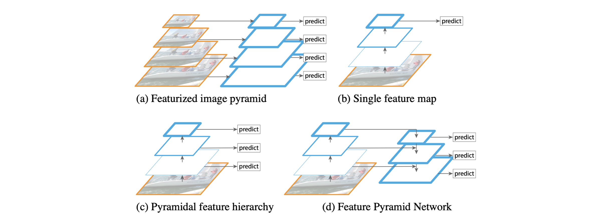
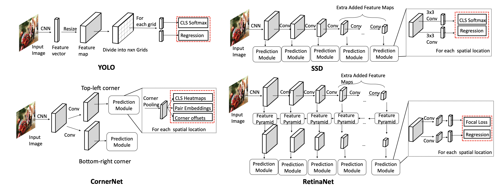

> Deep learning 기반의 object detection 알고리즘에 대해 리뷰합니다. Two-stage detector와 one-stage detector 알고리즘 중에서 유명한 알고리즘들을 위주로 간단히 정리하였습니다. 오타나 정확하지 않은 내용에 대해서 댓글 달아주시면 감사합니다.

### Introduction

- Localization: Object의 위치를 bouding box 형태로 알아내는 task
- Object detection: 이미지 내에 다수의 object가 존재할 때, 각각의 class를 맞추고 localization 하는 task
- RoI: Region of Interest
- Region proposal: Object가 있을 것 같은 영역을 제안
  - Selective search (e.g., Fast R-CNN): 인접한 region 사이의 유사도를 측정하고, 점점 큰 영역으로 통합하는 방법
  - Sliding window, Spatial anchor, RPN (e.g., Faster R-CNN): 다양한 크기의 window를 이미지 상에서 sliding 하면서 해당 위치에 물체가 존재하는지 확인하는 방법. [해당 유튜브 영상](https://www.youtube.com/watch?v=ZhvU7D_qKO8)에서 정말 잘 설명해주고 있음
- Localization layer: Bbox position를 제안하는 layer이고 일반적으로 regressor 활용
- Classification layer: Object의 class를 제안하는 layer
- RoI Pooling: RPN을 통해 나온 Proposal의 크기가 다 다른데, RoI pooling을 거치면 모두 사이즈가 같아짐 (e.g., Output size = 7x7 pooled feature)
- RoIAlign: mask R-CNN (Instance Segmentation model)에서 사용. RoI Pooling과 output size는 동일한데 pooling 값 계산하는 방식이 다름. 이후 연구들은 대부분 RoIAlign 사용함
- IoU (Intersection of Union): 예측 bbox와 정답 bbox가 겹치는 비율

$$
\text{IoU} = \frac{\text{두 bbox의 교집합}}{\text{두 bbox의 합집합}}
$$

```python
# Code by ChatGPT

def compute_iou(box, boxes):
    """
    Computes the IOU between a given box and a set of boxes.
    :param box: Numpy array with shape (4,) representing the coordinates of a bounding box.
    :param boxes: Numpy array with shape (N, 4) representing the coordinates of N bounding boxes.
    :return: Numpy array with shape (N,) containing the IOUs between the box and the N bounding boxes.
    """
    # Calculate coordinates of intersection boxes
    x1 = np.maximum(box[0], boxes[:, 0])
    y1 = np.maximum(box[1], boxes[:, 1])
    x2 = np.minimum(box[2], boxes[:, 2])
    y2 = np.minimum(box[3], boxes[:, 3])

    # Calculate area of intersection boxes and union boxes
    intersection = np.maximum(0.0, x2 - x1) * np.maximum(0.0, y2 - y1)
    area_box = (box[2] - box[0]) * (box[3] - box[1])
    area_boxes = (boxes[:, 2] - boxes[:, 0]) * (boxes[:, 3] - boxes[:, 1])
    union = area_box + area_boxes - intersection

    # Calculate IOU and return
    iou = intersection / union
    return iou
```

- Non-Maximum Suppression (NMS): 여러 개의 bbox가 동일한 class로 분류되면서 겹치는 경우에는 하나로(혹은 일부로) bbox 예측을 줄이는 방법

```python
# Code by ChatGPT

def non_maximum_suppression(bounding_boxes, confidence_scores, overlap_threshold):
    """
    Implements Non-Maximum Suppression on a set of bounding boxes and corresponding confidence scores.
    :param bounding_boxes: Numpy array with shape (N, 4) representing the coordinates of the N bounding boxes.
    :param confidence_scores: Numpy array with shape (N,) representing the confidence scores for the N bounding boxes.
    :param overlap_threshold: Float representing the maximum allowed overlap between two bounding boxes.
    :return: List with the indices of the selected bounding boxes.
    """
    # Sort bounding boxes by their confidence scores (highest to lowest)
    sorted_indices = np.argsort(-confidence_scores)

    selected_indices = []
    while sorted_indices.size > 0:
        # Select bounding box with highest confidence score
        best_box_index = sorted_indices[0]
        selected_indices.append(best_box_index)

        # Compute the IOUs between the selected bounding box and the remaining boxes
        remaining_indices = sorted_indices[1:]
        overlaps = compute_iou(bounding_boxes[best_box_index], bounding_boxes[remaining_indices])

        # Discard boxes with IOU greater than overlap threshold
        non_overlapping_indices = np.where(overlaps <= overlap_threshold)[0]
        sorted_indices = remaining_indices[non_overlapping_indices]

    return selected_indices
```

##### Evaluation Metric

- Average Precision (AP .5): IoU 0.5 이상을 true positive로 인식
- 11점 보간법과 모든점 보간법 계산법

$$
\begin{aligned}
& A P_{11}=\frac{1}{11} \sum_{R \in\{0,0.1,0.2, \ldots, 0.9,1\}} P_{\text {interp }}(R) \\
& {P}_{\text {interp }}({R})=\max _{\widetilde{{R}}: \widetilde{{R}} \geq {{R}}} {P}(\widetilde{{R}})
\end{aligned}
$$

$$
\begin{aligned}
& {A P}_{\text {all }}=\sum_n\left({R}_{n+1}-{R}_{{n}}\right) {P}_{\text {interp }}\left({R}_{n+1}\right) \\
& {P}_{\text {interp }}\left({R}_{n+1}\right)=\max _{\widetilde{{R}}: \widetilde{{R}} \geq {R}_{n+1}} {P}(\widetilde{{R}})
\end{aligned}
$$

- AP[.5:.05:.95]: AP .5, AP .55, ..., AP .95의 값을 모두 측정하여 평균. 모든점 보간법을 이용해서 AP를 구한 값의 평균, 즉, Precision-Recall Curve의 아래 면적을 의미

- mean Average Precision: 기본적으로 precision은 하나의 object에 대한 검출을 의미하므로, mAP는 각각의 class에 대해 AP[.5:.05:.95]를 계산하고 평균을 산출했다는 의미
  $$
  m A P=\frac{1}{N} \sum_{i=1}^N A P_i
  $$


<center><p><i>Taken from https://cocodataset.org/#detection-eval</i></p></center>

- Macro: '평균의 평균'을 구하는 방법. macro precision = (precision 1 + precision 2 + ... + precision K) / K where K is the number of classes
- Micro: '전체의 평균'을 구하는 방법. micro precision = TP / (TP + FP)

### Two-Stage Detector

Region proposals을 먼저 생성 한 이후에 object classification and bbox regression 수행. 따라서 속도가 느리지만 일반적으로 성능이 좋음 (최근에는 꼭 그렇지도 않은듯)


<center><p><i>Taken from  Wu, Xiongwei, Doyen Sahoo, and Steven CH Hoi.</i></p></center>

##### R-CNN (2014)[^1]

Region-Based Convolutional Neural Networks

1. 이미지에 대해 selective search를 이용하여 약 2000개의 RoI 추출. Selective search에 대한 설명은 [이곳](https://lilianweng.github.io/posts/2017-10-29-object-recognition-part-1/#selective-search) 참고
2. 각 RoI들을 warping (i.e., transforming image regions to a fixed size)
3. Warped image에 대해 CNN으로 feature 추출
4. Feature를 활용하여, SVM으로는 classification, regressor로는 bbox 예측(i.e., {x, y, width, height})을 수행

##### Fast R-CNN (2015)[^2]

1. 이미지에 대해 selective search를 이용하여 약 2000개의 RoI 추출 (*R-CNN과 동일*)
2. 입력 이미지를 그대로 CNN에 넣어 feature map을 추출. 즉, 입력 이미지가 CNN에 한 번만 forwarding 되어도 됨
3. RoI projection: 각각의 RoI를 feature map dimension으로 projection
4. RoI pooling 수행: Feature map에서의 각 RoI 영역에 대해 max-pooling 적용해서 NxN matrix 추출
5. 최종 feature를 활용하여 softmax layer으로는 classification, regressor로는 bbox 예측을 수행

##### Faster R-CNN (2015)[^3]

Prior works의 region proposal 방식이 bottleneck이었는데, RPN을 통해 end-to-end 형태의 구조 제안하여 성능 향상

1. 이미지를 CNN에 넣어 feature map을 추출
2. Feature map을 region proposal network(RPN)으로 보내 feature map에 대한 RoI 생성
   - RPN은 기본적으로 여러 개의 서로 다른 형태의 anchor boxes를 사용한 sliding window 방식 사용
   - RPN의 final layer에는 물체가 있는지 없는지 판단하는 2-softmax와, bbox 제안하는 regressor가 존재
   - 2-softmax와 regressor ouput을 기반으로 RoI 생성하고 이를 RoI pooling layer로 전달
3. RoI pooling 수행
4. 최종 feature를 활용하여 softmax layer으로는 classification, regressor로는 bbox 예측을 수행

##### Recap.

|              | Conference   | Region proposal             | Classification layer | Localization layer |
| ------------ | ------------ | --------------------------- | -------------------- | ------------------ |
| R-CNN        | CVPR 2014    | Selective search (CPU)      | SVMs                 | Regressor          |
| Fast R-CNN   | ICCV 2015    | Selective search (CPU)      | Softmax              | Regressor          |
| Faster R-CNN | NeurIPS 2015 | Sliding window w. RPN (GPU) | Softmax              | Regressor          |

##### Feature Pyramid Networks (2017)[^4]

Multi-resolution 정보를 최대한 활용하여 object detection 성능 향상을 이루고자 하는 연구들 많았는데 FPN도 그 중 하나임. 다양한 object detection 모델들의 backbone으로 활용되어 성능을 높여줌

- Featurized image pyramid: 입력 이미지를 여러 크기로 resize 하여 각각 CNN에 통과시켜 feature map 획득하는 방법. 당연히도 매우 느림
- Single feature map: 가장 마지막 feature map만 예측에 활용하므로 작은 object에 대한 정보 잘 잡지 못할 것임
- Feature Pyramid Network (FPN)
  - Bottom-up pathway와 top-down pathway 형태로 구성됨
  - Top-down pathway에서는 이전 layer feature와 bottom-up feature를 입력으로 받아 (adding 후에) upsampling 수행하여 feature map 뽑아내는데, 매 top-down pathway 마다의 feature map를 RPN(region proposal network)에 넣어 모델 예측 출력 가능
  - 즉, FPN 사용하면 multi-resolution feature를 뽑아내어 더 나은 object detection 가능



<center><p><i>Taken from Tsung-Yi Lin, et al.</i></p></center>

```python
# Sample code from https://github.com/jwyang/fpn.pytorch/blob/master/lib/model/fpn/fpn.py#L159
...
def forward(self, im_data, im_info, gt_boxes, num_boxes):
    batch_size = im_data.size(0)

    im_info = im_info.data
    gt_boxes = gt_boxes.data
    num_boxes = num_boxes.data

    # Bottom-up
    c1 = self.RCNN_layer0(im_data)
    c2 = self.RCNN_layer1(c1)
    c3 = self.RCNN_layer2(c2)
    c4 = self.RCNN_layer3(c3)
    c5 = self.RCNN_layer4(c4)
    
    # Top-down
    p5 = self.RCNN_toplayer(c5)
    p4 = self._upsample_add(p5, self.RCNN_latlayer1(c4))
    p4 = self.RCNN_smooth1(p4)
    p3 = self._upsample_add(p4, self.RCNN_latlayer2(c3))
    p3 = self.RCNN_smooth2(p3)
    p2 = self._upsample_add(p3, self.RCNN_latlayer3(c2))
    p2 = self.RCNN_smooth3(p2)

    p6 = self.maxpool2d(p5)

    rpn_feature_maps = [p2, p3, p4, p5, p6]
    mrcnn_feature_maps = [p2, p3, p4, p5]

    rois, rpn_loss_cls, rpn_loss_bbox = self.RCNN_rpn(rpn_feature_maps, im_info, gt_boxes, num_boxes)
```

### One-Stage Detector

Pre-generated region proposals 없이 object classification and bbox regression 수행



<center><p><i>Taken from  Wu, Xiongwei, Doyen Sahoo, and Steven CH Hoi.</i></p></center>

##### YOLO (2016)[^5]

1. 이미지를 N x N grid로 분할 (N=7)
2. 이미지를 CNN에 넣고 feature vector를 뽑아냄
3. 해당 feature vector를 resize해서 N x N x D의 feature map으로 변형
4. N x N이 각각의 grid를 의미하는데, 하나의 D size feature를 (x, y, w, h, confidence socre)과 (class probabilities)로 활용

```python
# Sample code from https://github.com/motokimura/yolo_v1_pytorch/blob/master/yolo_v1.py
...
def forward(self, x):
    S, B, C = self.feature_size, self.num_bboxes, self.num_classes
    x = self.features(x)
    x = self.conv_layers(x)
    x = self.fc_layers(x)
    x = x.view(-1, S, S, 5 * B + C)
    return x
```

##### RetinaNet (2017)[^7]

- Backbone으로 FPN 사용함
- Foreground, background의 imabalance를 해결하기 위한 focal loss 제안. Easy negative example보다 hard example에 더 많은 가중치를 주는 효과 가짐

$$
\begin{aligned}
&\text { Cross Entropy }=-\log \left(p_{t}\right) \\
&\text { Focal Loss }=-\left(1-p_{t}\right)^{\gamma} \log \left(p_{t}\right)
\end{aligned}
$$

##### DETR (2020)[^8]

- Prior works들이 NMS나 spatial anchors(RPN) 같은 hand-designed components 너무 많이 요구함. 따라서 customized layer drop하는 단순한 구조 제안
- Bipartite matching (e.g., *Hungarian algorithm*): 기존엔 set prediction problem을 NMS 등으로 간접적으로 해결했는데, bipartite matching은 object 출력을 아예 N개로 고정시켜 버려서 directly predicts the set of detections
  - 예를 들어 N=10이고 object=2라면, 8개는 no object로 예측하면 됨


<center><p><i>Taken from Nicolas Carion, et al.</i></p></center>

1. CNN 활용하여 image feature 추출. Image feature는 $C \times H \times W$ 의 shape의 feature map인데, $C=2048$이고, 이미지의 height $H_0$, width $W_0$라 할 때 $H, W = \frac{H_0}{32}, \frac{W_0}{32}$임
2. Image feature map에 positional encoding 더하여 transformer encoder에 입력
3. Decoder에 object queries와 encoder output을 입력. 이 때, object query는 N개(max obejct 수)임
4. Decoder output을 각각 feed forward network에 입력하고, object가 있는지 없는지, 있다면 class는 무엇이고 bbox는 어떻게 되는지를 출력
5. 최종 (prediction head의) 출력에 대해 bipartite matching (i.e., Hungarian algorithm) 수행 후, loss 계산하여 모델 학습. Class prediction loss와 Generalized IoU 활용한 box loss 사용

### References

##### Blog Posts

- https://lilianweng.github.io/posts/2017-12-31-object-recognition-part-3/
- https://lilianweng.github.io/posts/2018-12-27-object-recognition-part-4/

##### Papers

[^1]:Girshick, Ross, et al. "Rich feature hierarchies for accurate object detection and semantic segmentation." *Proceedings of the IEEE conference on computer vision and pattern recognition*. 2014.
[^2]: Girshick, Ross. "Fast r-cnn." *Proceedings of the IEEE international conference on computer vision*. 2015.
[^3]: Ren, Shaoqing, et al. "Faster r-cnn: Towards real-time object detection with region proposal networks." *Advances in neural information processing systems* 28 (2015).
[^4]: Lin, Tsung-Yi, et al. "Feature pyramid networks for object detection." *Proceedings of the IEEE conference on computer vision and pattern recognition*. 2017.
[^5]: Redmon, Joseph, et al. "You only look once: Unified, real-time object detection." *Proceedings of the IEEE conference on computer vision and pattern recognition*. 2016.
[^6]:Liu, Wei, et al. "Ssd: Single shot multibox detector." *Computer Vision–ECCV 2016: 14th European Conference, Amsterdam, The Netherlands, October 11–14, 2016, Proceedings, Part I 14*. Springer International Publishing, 2016.
[^7]: Lin, Tsung-Yi, et al. "Focal loss for dense object detection." *Proceedings of the IEEE international conference on computer vision*. 2017.
[^8]: Carion, Nicolas, et al. "End-to-end object detection with transformers." *Computer Vision–ECCV 2020: 16th European Conference, Glasgow, UK, August 23–28, 2020, Proceedings, Part I 16*. Springer International Publishing, 2020.
[^9]: Zou, Zhengxia, et al. "Object detection in 20 years: A survey." *Proceedings of the IEEE* (2023).
[^10]: Wu, Xiongwei, Doyen Sahoo, and Steven CH Hoi. "Recent advances in deep learning for object detection." *Neurocomputing*396 (2020): 39-64.
